# 操作指南

[TOC]

## 虚拟机启动软件：VMWare Workstation Pro 17

### 下载

这边提供一种下载方式：

- 官网下载：需要注册，比较麻烦，所以这边直接提供下载直链

  [VMWare Workstation Pro 17](https://softwareupdate.vmware.com/cds/vmw-desktop/ws/17.5.2/23775571/windows/core/VMware-workstation-17.5.2-23775571.exe.tar)

下载完毕之后，解压文件，双击.exe文件即可进入安装界面

### 安装

双击之后等待安装程序初始化，直到显示以下界面

单击`下一步`

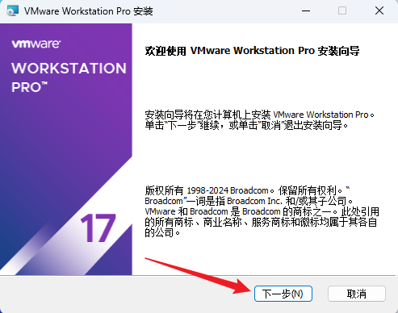

勾选`我接受许可协议中的条款`，然后单击下一步

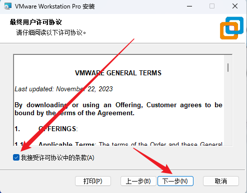

选择安装位置，最好选择非C盘的磁盘进行安装，其余保持默认，确定后单击下一步

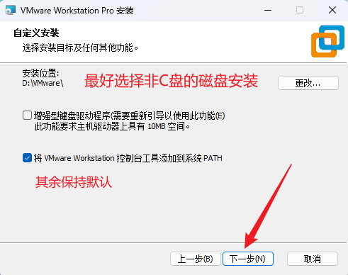

取消勾选所有选项，然后单击下一步

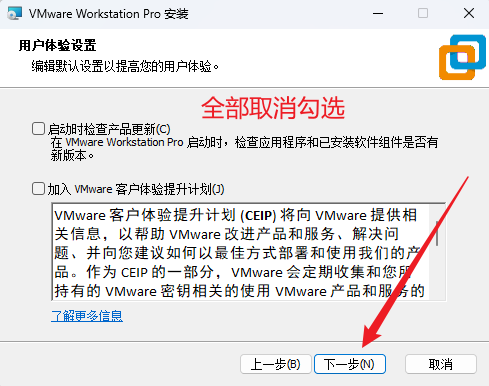

根据个人喜好选择创建快捷方式的位置，确定后单击下一步

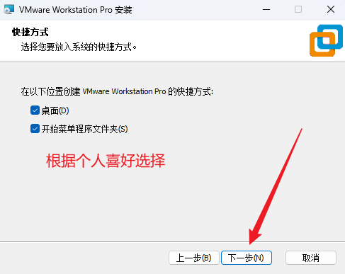

之后单击`安装`之后开始安装

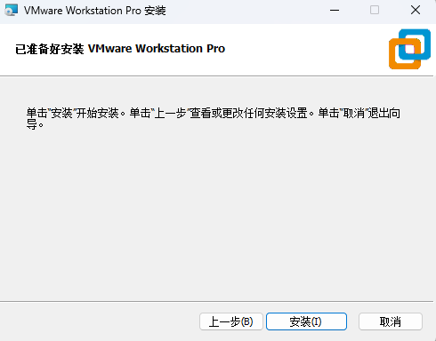

等待程序安装完毕即可

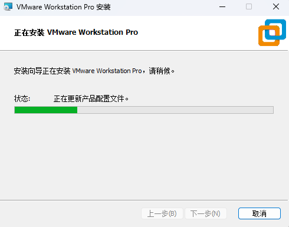

出现以下界面即安装完成，点击`完成`完成安装并退出安装界面

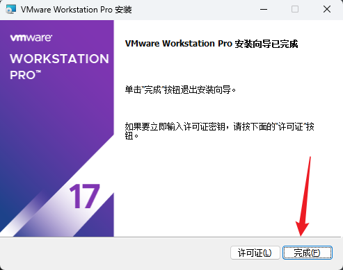

双击桌面图标，出现以下界面，选择`将 VMware Workstation 17 用于个人用途(U)`，确定后单击继续

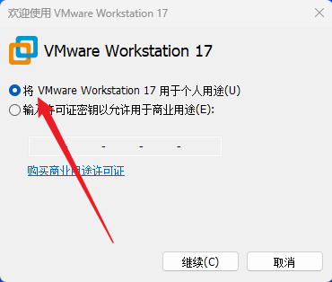

之后单击`完成`即可进入使用界面

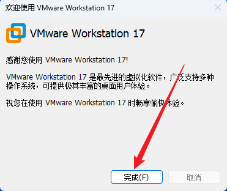

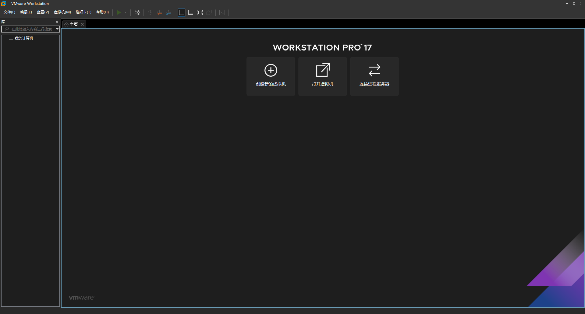

## 创建虚拟机：Deepin-desktop-community-23

### 下载ISO映像文件

这边提供两种下载方式

- 官网下载：

  [Deepin-desktop-community-23](https://www.Deepin.org/zh/download/)

- 清华大学镜像站：

  [Deepin-desktop-community-23](https://mirrors.tuna.tsinghua.edu.cn/deepin-cd/23/amd64/)

  >下载说明：如何选择 Deepin 23 ISO 镜像的架构？
  >
  >1. 什么是 "架构"（Architecture）？
  >
  >   操作系统的 "架构" 指的是它设计时针对的硬件平台类型。不同的硬件（特别是处理器）有不同的架构要求，因此操作系统需要匹配特定的架构才能正常运行。常见的架构有：
  >
  >   - **x86（又称 i386）**：这是一种较旧的32位架构，现今已经不常见，主要用于旧款电脑。
  >
  >   - **amd64（又称 x86_64）**：这是64位架构的标准，支持更大的内存和更高的性能。尽管名字里有 "amd"，但它适用于大多数现代的64位处理器，包括 Intel 和 AMD 生产的处理器。
  >
  >   - **arm64（又称 aarch64）**：这是针对 ARM 处理器（例如智能手机、一些平板和一些低功耗设备）的64位架构。
  >
  >2. 如何选择适合的架构版本？
  >
  >   - **amd64：**
  >
  >     这是目前最常见的架构，几乎所有现代台式机和笔记本电脑都使用这种架构（包括大部分 Intel 和 AMD 的处理器）。如果你的计算机使用的是64位的 Intel 或 AMD 处理器，你就应该选择 **amd64** 版本。
  >
  >   - **arm64：**
  >
  >     如果你使用的是 ARM 架构的设备，比如一些较新的高效能笔记本、树莓派、或者一些特殊设备（如某些平板电脑和手机），你可能需要选择 **arm64** 版本。
  >
  >     ARM架构的设备和 x86 架构设备不同，它们需要不同的操作系统镜像文件。**选错版本**会导致无法启动或者运行不稳定。
  >
  >3. 如何判断你的电脑（**Windows**）使用的是哪种架构？
  >
  >   你可以通过右键点击 “此电脑” -> “属性” 查看系统类型。一般会显示 “64位操作系统” 或 “32位操作系统”，从而知道自己使用的是哪个架构。
  >
  >   - 如果“64位操作系统”，一般是选择 amd64 或者
  >
  >   > 如果你想
  >
  >4. 如何选择 ISO 镜像文件？
  >
  >   当你在镜像站或者其他网站上下载 ISO 镜像时，确保选择与你的硬件架构相对应的版本：
  >
  >   - 如果你的电脑是基于 Intel 或 AMD 的 64 位处理器，选择 **amd64**。
  >
  >   - 如果你使用的是 ARM 架构的设备，选择 **arm64**。

下载完成后，建议将文件保存在专门的文件夹中，而不是直接放在下载文件夹里。

> 虚拟机需要使用该ISO映像文件进行构建。为了避免不小心删除文件导致的后续问题，建议将其保存在一个专门的文件夹中。

### 创建虚拟机

打开WMware Workstation Pro 17，在主页点击`创建新的虚拟机`

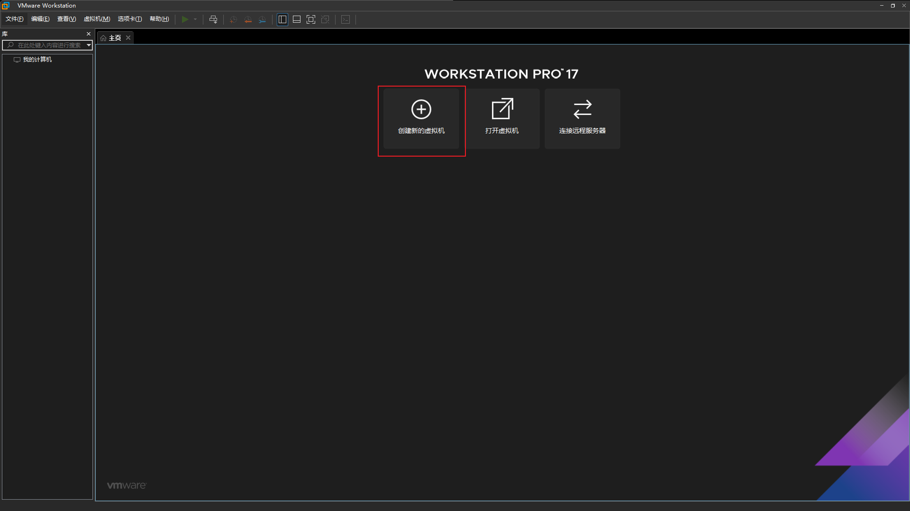

在弹出的`欢迎使用新建虚拟机向导`窗口，勾选`自定义(高级)(C)`，确定后点击下一步

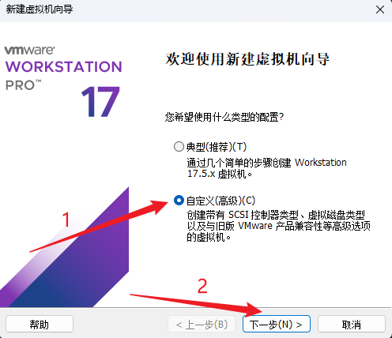

在接下来的`选择虚拟机硬件兼容性`界面中，无需进行任何设置，保持默认即可，所以直接点击下一步

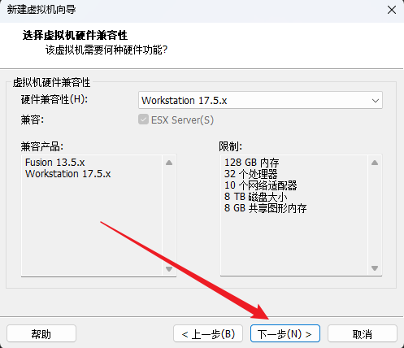

在`安装客户机操作系统`界面，勾选`稍后安装操作系统(S)。`，确定后点击下一步

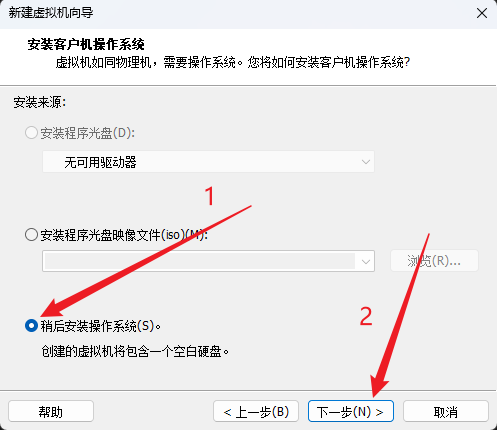

在接下来的界面中

- `客户机操作系统`选项卡勾选`Linux(L)`
- `版本(V)`选项卡中，点击下拉框，找到`其他 Linux 5.x 内核 64 位`

确定后点击下一步

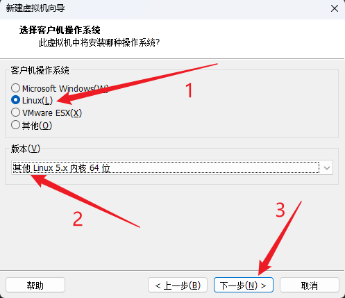

在`命名虚拟机`界面：

- 推荐更改默认的名称为Deepin或者下图中的名称，方便出现后期创建的虚拟机变多的情况时，更好的识别并找到本虚拟机
- 虚拟机位置一定要放置在C盘之外的其他磁盘

> 虚拟机占用空间一般较大，通常分配几十G作为虚拟机的存储空间
>
> 所以除了没有分盘而只有一个C盘的情况，基本都会**要求**将虚拟机的位置放置在C盘之外的其他磁盘

确定后点击下一步

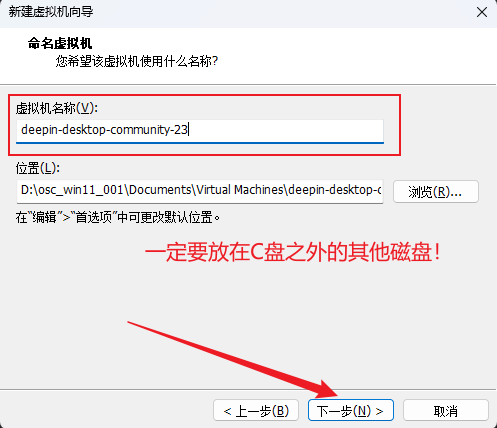

在`处理器配置`界面，通常保持默认即可，如果安装前**有明确的性能要求**，再根据要求调整即可，虚拟机**创建完成之后**也可以再次修改

确定后点击下一步

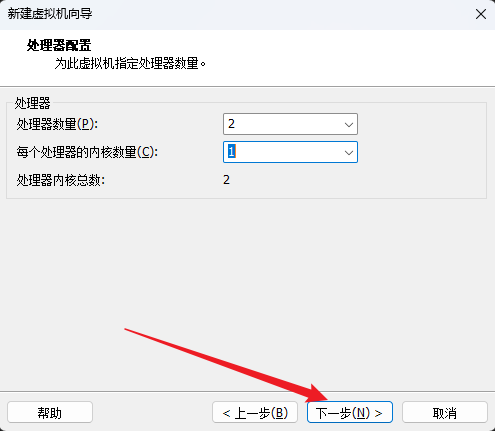

在`此虚拟机的内存`界面，我们不按照 VMware 推荐的内存配置进行操作，而是选择 2GB 或者 4GB ，即 2048MB 或者 4096MB

确定后点击下一步

> 对于普通桌面使用，Deepin-desktop-community-23 在 2GB 内存下可以流畅运行
>
> 但在机器支持的情况下，配置 4GB 内存将提供更好的体验，特别是需要运行多个应用程序时。
>
> 我们没有按照软件推荐的内存配置，因为在之前的步骤中我们并没有明确选择具体的操作系统，因此 VMware 默认推荐的是最基础安装（最小化配置）下的内存需求。实际上，大多数现代 Linux 操作系统（包括 Deepin 23）通常需要至少 2GB 的内存才能流畅运行。

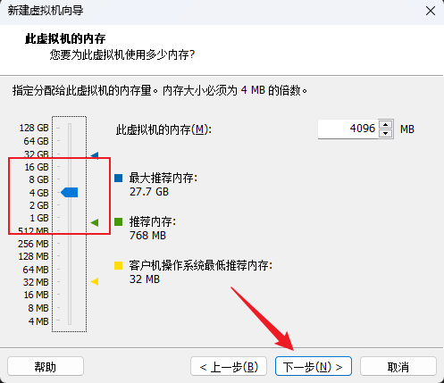

在`网络类型`界面，不需要进行任何操作，保持默认即可，确定后点击下一步

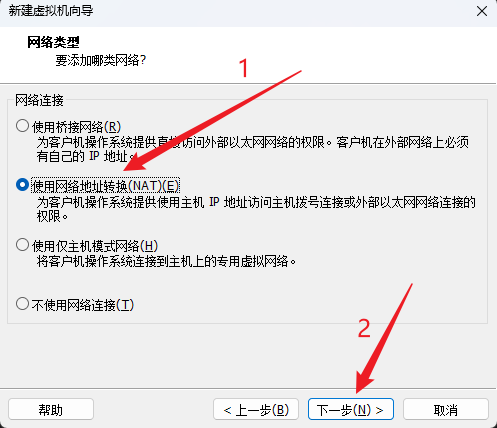

在接下来的`选择I/O控制器类型`、`选择磁盘类型`和`选择磁盘`这三个个界面，同样保持默认，确定后直接点击下一步

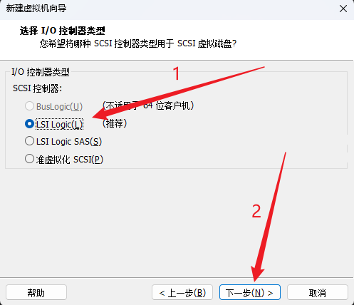

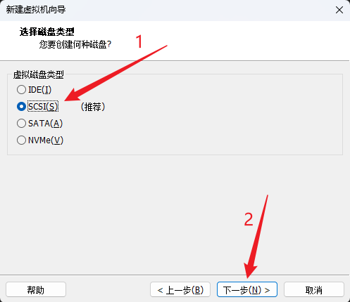

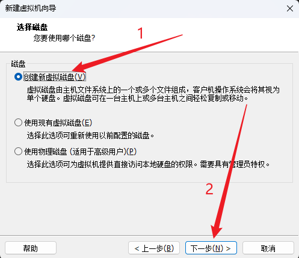

而到了`指定磁盘容量`界面，我们也不按照 VMware 推荐的磁盘配置进行操作，而是选择 80GB 或者以上，根据性能和使用需求决定

> 我们没有按照软件推荐的磁盘配置，原因与内存配置类似：在之前的步骤中没有明确选择具体的操作系统，VMware 因此默认推荐了最基本环境和最小化软件安装下的磁盘需求。实际上，Deepin 23 官方推荐的最小磁盘大小为 64GB ，并且随着时代的发展，软件的功能不断丰富，所占用的存储空间也越来越大。因此，我们建议分配至少 80GB 或更多的磁盘空间，以确保系统能够顺利运行并为将来安装更多应用程序留有足够的空间。

确定后点击下一步

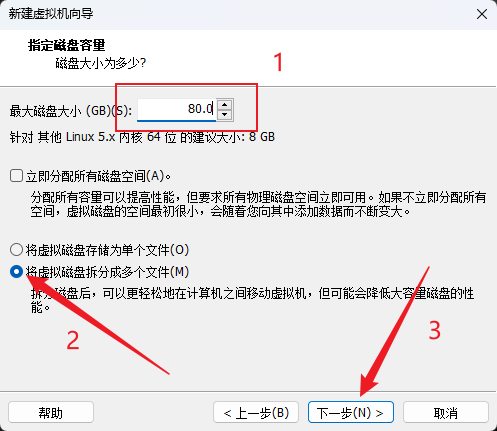

在`指定磁盘文件`界面，同样不做什么操作，保持默认即可，确定后点击下一步

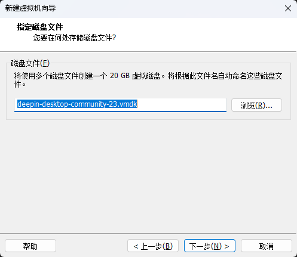

这样我们就进行到最后一步了，直接点击完成即可创建虚拟机

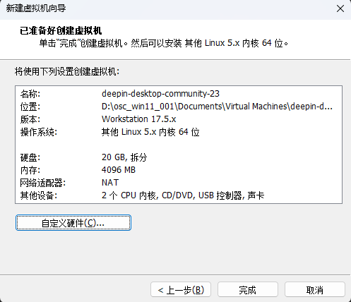

等待一段时间之后，出现以下界面即创建虚拟机成功

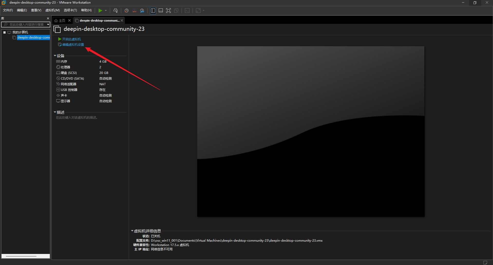

此时点击`编辑虚拟机设置`，进到`虚拟机设置`界面

- 首先找到`硬件`选项卡d中的`CD/DVD(SATA)`选项
- 勾选右侧的`使用ISO映像文件`，并选择刚刚下载的**Deepin-desktop-community-23.iso**文件

确定后点击右下角的确定

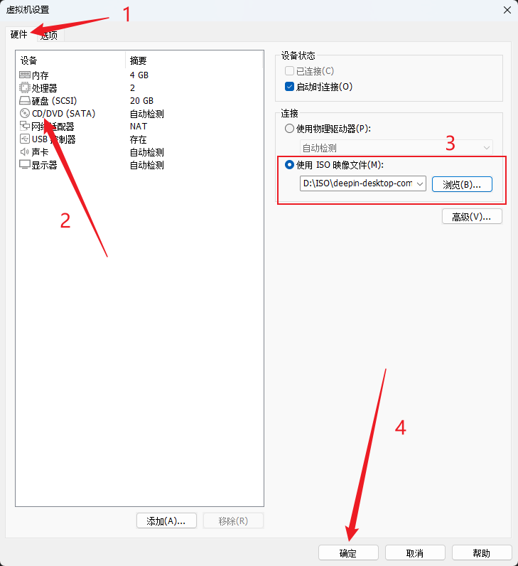

到这里我们就基本完成了对虚拟机的创建，点击`开启此虚拟机`就能启动虚拟机了

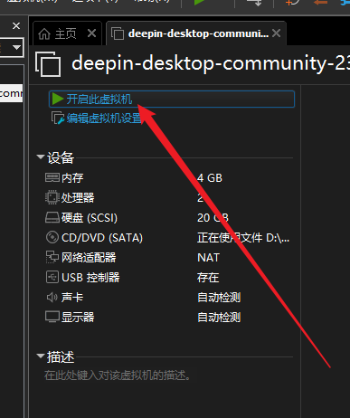

### 安装Deepin操作系统

点击`开启此虚拟机之后`，等待VMware进行加载

> 在等待的过程中，可能会出现以下两个弹窗：
>
> - 第一个：
>
>   这个没什么关系的，直接点击确定即可，如果不想每次启动时看见这个弹窗，勾选内容下方的`不再显示此提示(S)`，确定后点击确定即可
>
>   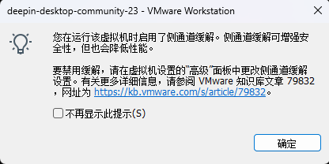
>
> - 第二个：
>
>   这个工具还是非常必要的，因为宿主机（即你的 Windows 或 macOS）无法直接与在 VMware 中运行的虚拟机进行文件传输或复制粘贴操作。所以 VMware 提供了 `VMware Tools for Linux`这个能够解决上述问题的工具 。那么当出现下图所示的安装弹窗时，点击下载并安装即可。
>
>   如果不需要该功能，或有其他方法进行文件传输和文字复制粘贴，当然也可以选择不安装此工具。
>
>   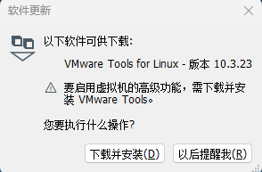
>
>   点击`下载并安装(D)`之后，等待VMware下载并验证此工具即可
>
>   > 验证时会需要用到管理员权限，点击弹窗中选项的`是`即可

直至出现以下界面，此时我们选择第二个选项`Install Deepin 23 with Kernel 6.6 desktop`，选择后按下回车键`Enter`

然后等待虚拟机自行处理并安装Deepin操作系统

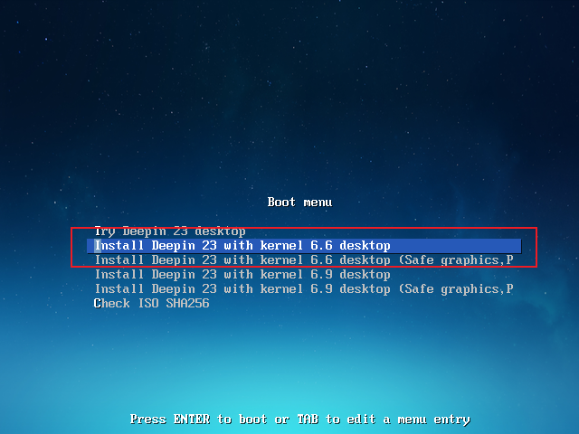

出现以下界面即安装完成

在`选择语言`界面，选择简体中文，并勾选`我已仔细阅读并同意 《最终用户许可协议》 和 《隐私政策》`

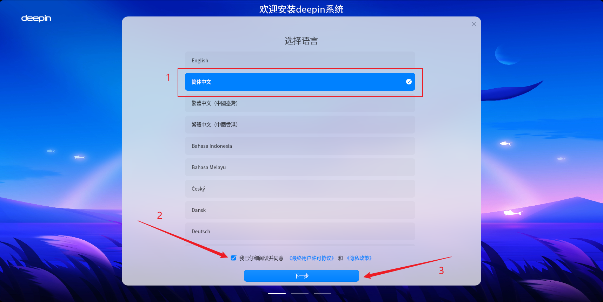

在`安装方式`界面，选择`全盘安装（推荐）`

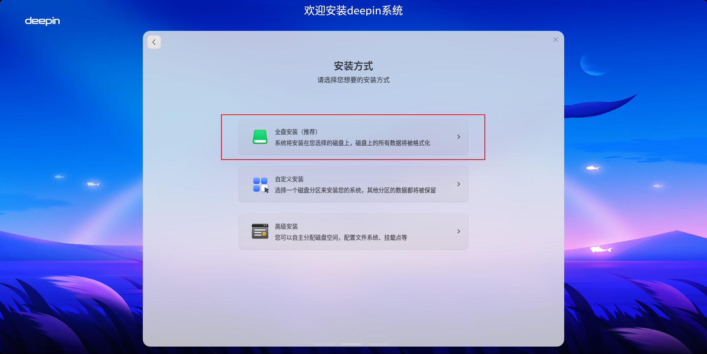

在接下来的界面中，点击图片中框选的磁盘，其余保持默认即可，确定后点击下一步

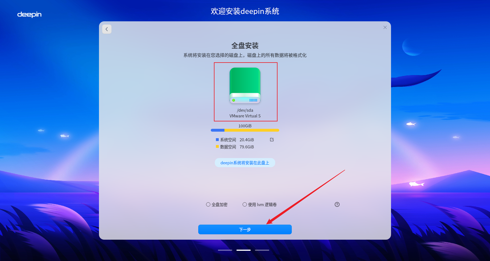

在`准备安装`界面，勾选`创建初始化备份`，确定后点击`开始安装`

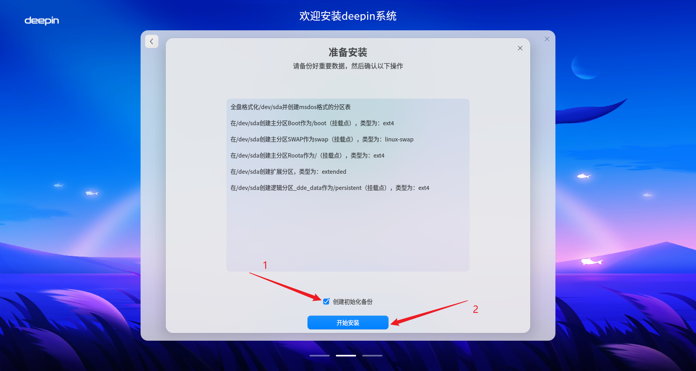

之后等待安装完成即可

出现以下界面即完成了安装，之后点击`立即重启`重启虚拟机即可

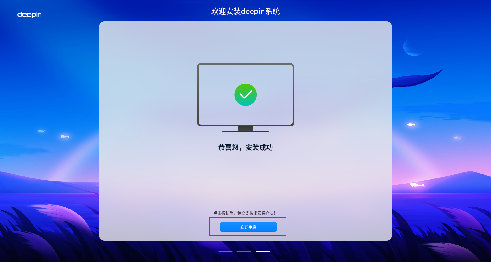

点击之后，等待虚拟机重启并加载，直到出现`创建用户`界面

在`创建用户`界面，根据自己的喜好，修改头像、设置用户名和密码等（**一定要把密码记下来！**）

确定后点击下一步

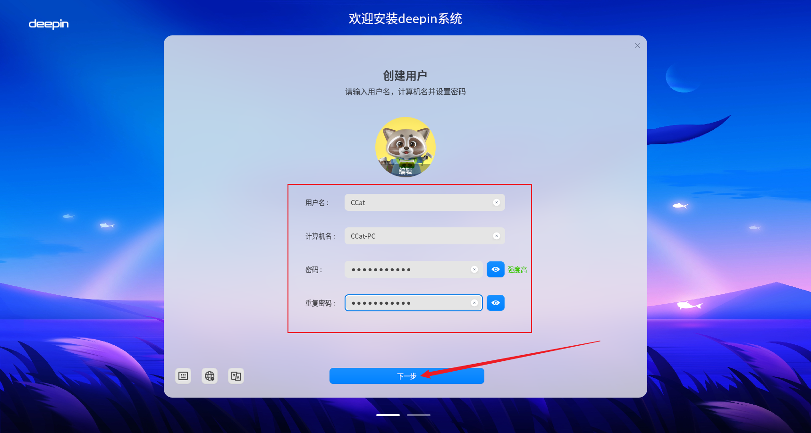

之后等待系统配置完成我们的电脑即可

出现以下界面，并输入我们刚刚设置密码之后，就可以进入系统啦！

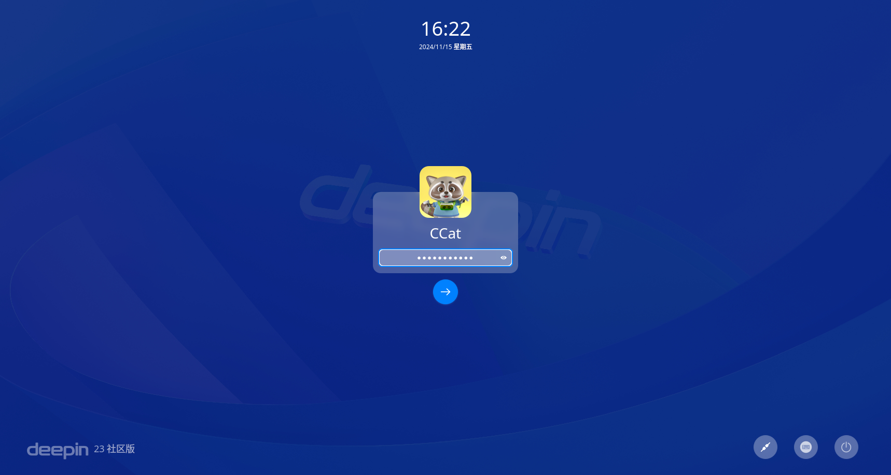

之后系统会对我们的使用习惯进行一个设置，在这里我就不演示了，大家按照自己的喜好设置即可

## 安装 玲珑 包管理工具

### 前提操作：安装`OpenSSH`

在 Deepin 23 系统桌面右键，选择`在终端中打开`

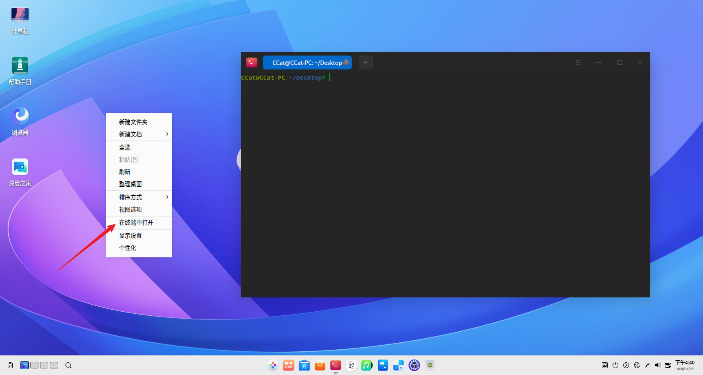

- 此时在终端中输入以下命令，确定后按下回车键`Enter`

  ```
  sudo apt install openssh-server
  ```

- 在执行命令后，系统会提示我们输入密码，这里需要输入我们在安装系统时设置的密码。

  > 需要注意的是，以下有两点需要特别解释：
  >
  > - **输入密码时不显示字符**：在输入密码时，终端不会显示任何字符，甚至是星号（`*`）。这是为了保护用户隐私，避免密码被旁人看到。这个设计是出于安全考虑，确保密码在输入时不会被泄露
  > - **为什么需要输入密码**：命令前面的 `sudo` 表示我们以管理员权限执行该命令。`sudo` 代表 "Super User DO"，即以超级用户身份执行操作。由于管理员权限拥有对系统的完全控制，滥用或盗用管理员权限可能导致严重的安全风险，如信息泄露或系统损坏。因此，系统要求输入密码，以确认执行该操作的是系统的合法用户，避免权限被恶意滥用

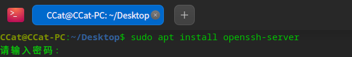

-  在安装时，系统会告诉我们需要占用的空间并询问我们是否继续，这时候输入`Y`即可，

  输入完成之后按下回车键`Enter`，系统将继续安装操作

  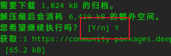

当终端出现新的命令提示符（例如 `用户名@计算机名:~/Desktop$`）时，表示安装已完成。

在完成前提操作之后，我们就可以安装 玲珑 包管理工具了

### 正式安装

当完成前提操作之后，我们就可以进行正式的安装 玲珑 包管理工具了

此时，在原来的终端界面或者重新打开一个终端

- 输入第一条命令，之后输入密码，并按下回车键`Enter`

  ```
  sudo apt install linglong-builder linglong-box linglong-bin
  ```

- 命令执行完毕之后，输入第二条命令，再次输入密码，并按下回车键`Enter`

  ```
  sudo apt install linglong-pica
  ```

- 在安装时，系统会同样会告诉我们需要占用的空间并询问我们是否继续，这时候同样输入`Y`即可

  输入完成之后按下回车键`Enter`，系统将继续安装操作
  
  > 如果不想

当终端出现新的命令提示符（例如 `用户名@计算机名:~/Desktop$`）时，表示安装已完成

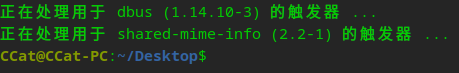

## 安装 npm 

### 更新软件包列表

推荐在每次安装任何新软件之前，更新一下咱们的软件包列表，确保安装的是最新版本

所以我们打开终端，并执行以下命令：

```
sudo apt update
```

### 安装 Node.js 和 npm（使用 NodeSource 仓库）

npm 是 Node.js 的包管理器，通常在安装 Node.js 时会一起安装

为了确保安装最新的 Node.js 和 npm，我们就从 NodeSource 仓库安装

- 首先，添加 NodeSource 的 Node.js 仓库：

  ```
  curl -sL https://deb.nodesource.com/setup_18.x | sudo -E bash -
  ```

  > 这里我们使用的是 Node.js 18.x 版本，你也可以替换为其他版本（比如 `setup_16.x` 或 `setup_20.x`）来安装其他版本的 Node.js
  > 同时目前也没有确定到底使用哪个具体的版本，可以先安装

  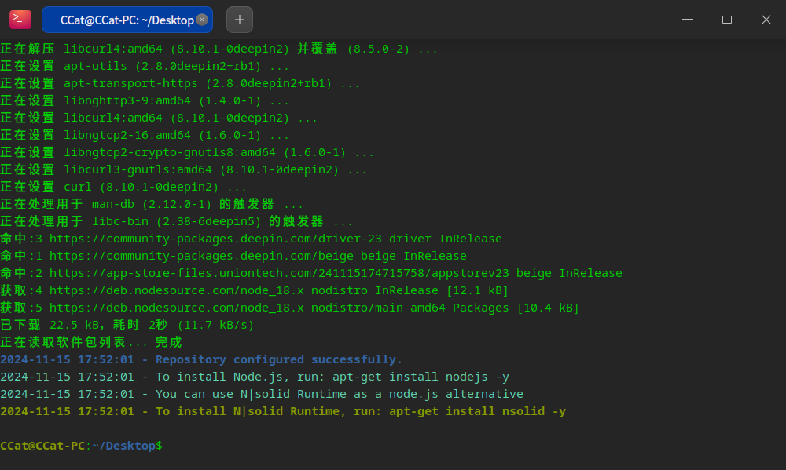

- 然后，安装 Node.js（它会自动安装 `npm`）：

  ```
  sudo apt install nodejs
  ```

  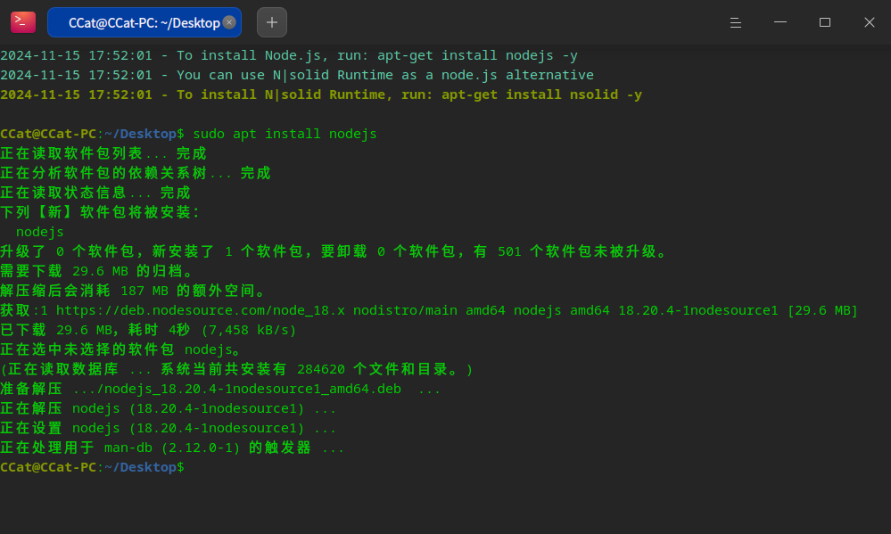

这样就可以安装好 Node.js 和 npm了

### 验证安装

安装完成后，可以通过以下命令检查 Node.js 和 npm 的版本，确保它们已正确安装：

- 检查 **Node.js** 版本：

  ```
  node -v
  ```

- 检查 **npm** 版本：

  ```
  npm -v
  ```

  如果输出显示了版本号，说明安装成功。

  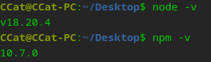


这样就完成了基于Deepin 23的玲珑应用安装。

