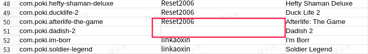
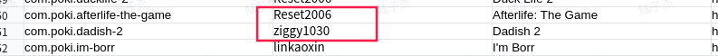
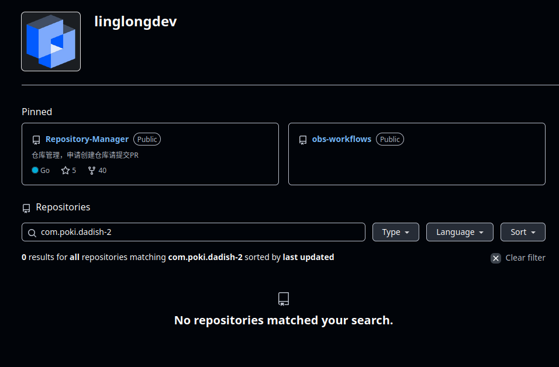
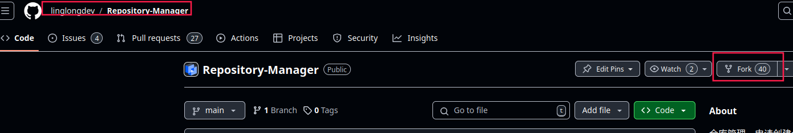
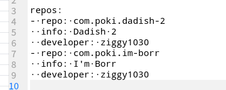
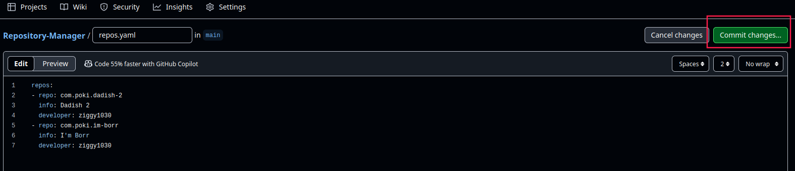
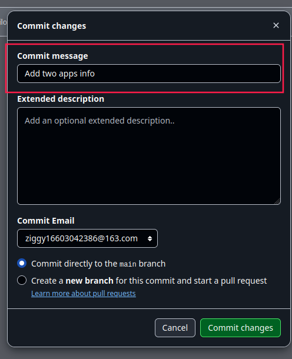

# 玲珑应用贡献工程实操
本部分用于指引同学们根据实践课堂中提供的应用清单, 在如意玲珑开源社区生态维护小组中提交一个应用的维护申请
\* 此文档为非通用贡献指引文档, 非此类活动中产出的贡献请参考其他通用贡献文档

目前支持同学们提交生态贡献的途径主要有:

1. 贡献者通过在如意玲珑开源社区GitHub平台上的[公共构建平台](https://github.com/linglongdev)来提交应用维护仓库创建申请, 申请通过后开始正式贡献
2. 贡献者通过[统信开发者应用分发平台](https://www.chinauos.com/partner/distribute)使用个人开发者账户上传玲珑应用安装包 `binary.layer` 

### GitHub公共构建平台 贡献演示
若你决定通过GitHub公共构建平台进行玲珑生态的贡献, 在此之前你应当持有一个可以正常进行活动的GitHub账户以及保持网络连接顺畅.

1. 访问活动中所提供的[共享文档--应用申领池](https://doc.weixin.qq.com/sheet/e3_AeUAowYWADcevxnRJXCRbCNoa8MHY?scode=AEoAsgdxAAYRJQNShIAeUAowYWADc&tab=000001)来申请成为合你心意的应用维护者并在 `developer` 中填写 `GitHub用户名`, 申领前确认该应用对应的 `developer` 为空值则表示当前应用暂时无人维护, 否则不允许申领已有维护人的应用

2. 访问[公共构建平台](https://github.com/linglongdev), 在 `Repositories` 页面搜索你在[共享文档--应用申领池](https://doc.weixin.qq.com/sheet/e3_AeUAowYWADcevxnRJXCRbCNoa8MHY?scode=AEoAsgdxAAYRJQNShIAeUAowYWADc&tab=000001)中认领的应用包名, 以此来降低应用维护重叠的风险

譬如, 你在[共享文档--应用申领池](https://doc.weixin.qq.com/sheet/e3_AeUAowYWADcevxnRJXCRbCNoa8MHY?scode=AEoAsgdxAAYRJQNShIAeUAowYWADc&tab=000001)中认领了一款应用, 包名为 `com.poki.dadish-2`, 那么你可以在搜索处搜索 `com.poki.dadish-2` 来查看是否已有同名仓库存在

3. 确认不存在已被认领的应用后, 就可以开始申领应用的流程了, 在这里表现为在[公共构建平台](https://github.com/linglongdev)组织中申请一个仓库. 通过提交 `Pull requests` 来启动仓库申请流程.
\* 提交PR前, 你需要先fork此仓库再修改、提交 

4. 确认不存在同名仓库后, 就可以开始申领应用的流程了, 在这里表现为在[公共构建平台](https://github.com/linglongdev)组织中申请一个仓库
参考[公共构建平台 仓库管理指导](https://github.com/linglongdev/Repository-Manager) 通过提交 `Pull requests` 来启动仓库申请流程.
\* 提交PR前, 你需要先fork此仓库再修改、提交 

流程合并后, 我们将会在[公共构建平台](https://github.com/linglongdev)的仓库列表中找到我们申请的应用专有仓库,这意味着我们从此刻起已经成为该应用的常态维护者了

### 操作图例
\* 此步骤完整说明可以查阅: [公共构建平台 仓库管理指导](https://github.com/linglongdev/Repository-Manager) 

1. 仓库中寻找暂未被认领的应用并并在 `developer` 中填写 `GitHub用户名`

2. 访问[公共构建平台](https://github.com/linglongdev)并进行仓库查重, 在 `Repositories` 页面搜索已认领的包名

3. 确认不存在已被认领的应用后, 开始申领应用. `fork` [Repository-Manager](https://github.com/linglongdev/Repository-Manager) 仓库到当前用户下

4. fork 完成后, 进入自己forked的 `Repository-Manager` 仓库中, 找到 `repos.yaml` 文件, 点击指示位置的功能按钮进行编辑
\* 文本类资源一般会出现空格字符等不可见内容, 建议复制内容到外部编辑器中修改
\* 同一个 `Pull Requests` 中支持同时提交数个仓库的申请

5. 修改完成后将内容粘贴至页面中, 平台检测到内容变动即可提交commit

\* commit信息格式为: `Add $num apps info`, $num填写实际申请仓库的数量

6. commit提交完成后, 即可在自己的仓库中找到 `Contribute` 功能, 由此打开 `Pull Requests` 页面进行本次提交, title 与 commit 信息保持一致

流程合并后, 我们将会在[公共构建平台](https://github.com/linglongdev)的仓库列表中找到我们申请的应用专有仓库,这意味着我们从此刻起已经成为该应用的常态维护者了